# Linux DO Part 1

## Part 1. Установка ОС

- На рисунке 1_1 показана версия убунту.

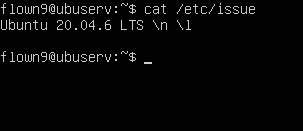

## Part 2. Создание пользователя

- На рисунке 2_1 показаны команды для создания пользователя testuser, добавления в группу adm.

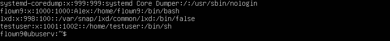

## Part 3. Настройка сети ОС

- На рисунке 3_1 показывана команда, с помощью которой открывается vim и задается название машины вида user-1.

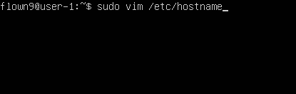

- На рисунке 3_2 показана команда для установки временной зоны, соответсвующую моему текущему местоположению.

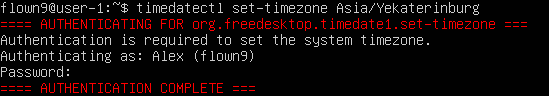

- На рисунке 3_3 показана команда для вывода сетевых интерфейсов, а также сам вывода.

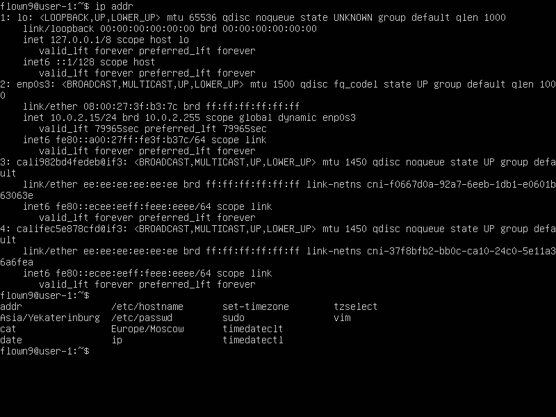

- Интерфейс lo (loopback) используется для отправки данных на самого себя.

- Он не связан с каким-либо физическим оборудованием и служит для тестирования и внутренней связи.

- Программы могут обращаться к этому адресу, чтобы общаться с сервером или сервисом на том же устройстве.

- Без loopback-интерфейса многие локальные сетевые сервисы не будут работать, потому что они используют его для взаимодействия.

- На рисунке 3_4 показана команда для получения ip адреса устройства от DHCP-сервера.

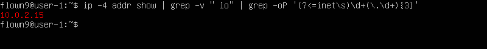

- DHCP (Dynamic Host Configuration Protocol).

- На рисунке 3_5 показана команда и вывод внешнего ip-адреса шлюза.

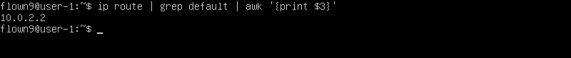

- На рисунке 3_6 показана команда и вывод внутреннего ip-адреса шлюза.

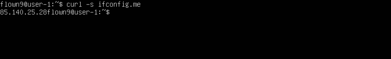

- С помощью команды sudo vim /etc/netplan/*.yaml открывается yaml-файл через vim, где задаем настройки ip, gw, dns. Это показано на рисунке 3_7.

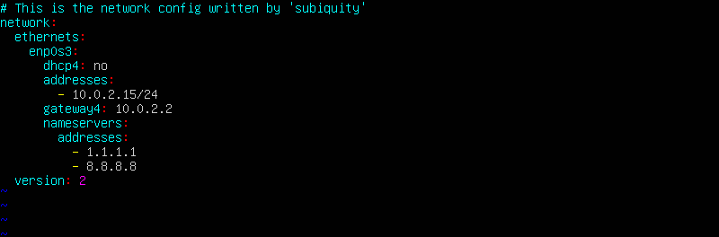

- После перезагрузки виртуальной машины с помощью команды sudo reboot статичные сетевые настройки соответствуют заданным.

- Были успешно пропингованы хосты 1.1.1.1 ya.ru с помощью команды ping. Это показано на на рисунке 3_8.

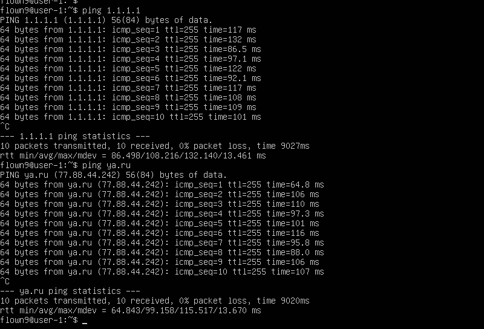

## Part 4. Обновление ОС

- На рисунке 4_1 показано, что все системные пакеты обновлены.

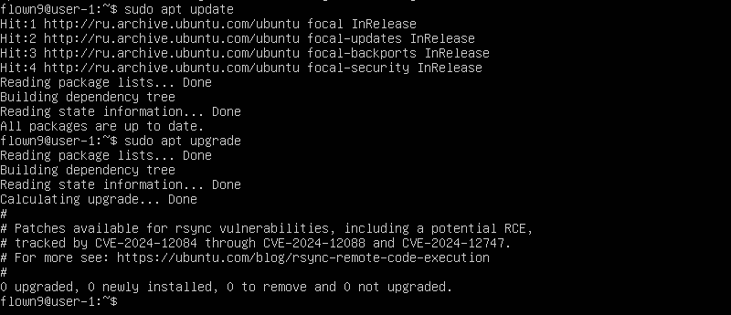

## Part 5. Использование команды sudo

- Команда sudo предоставляет временный доступ к административным задачам без необходимости предоставления полного доступа к root-аккаунту.

- Замена hostname ОС от имени пользователя, созданного в пункте Part 2. Это показано на рисунке 5_1.

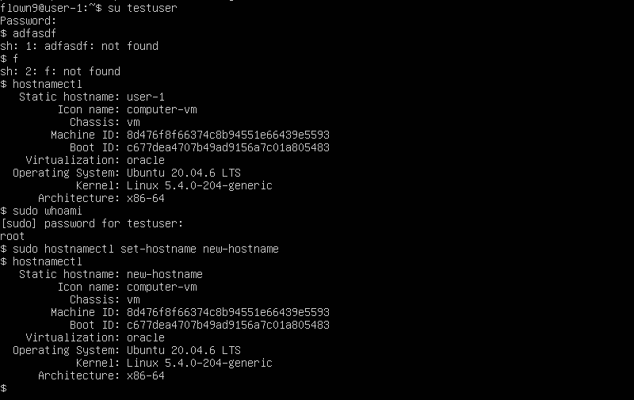

## Part 6. Установка и настройка службы времени

- С помощью команды sudo systemctl enable systemd-timesyncd --now включим синхронизацию времени.

- Корректное время и вывод команды показаны на рисунке 6_1.

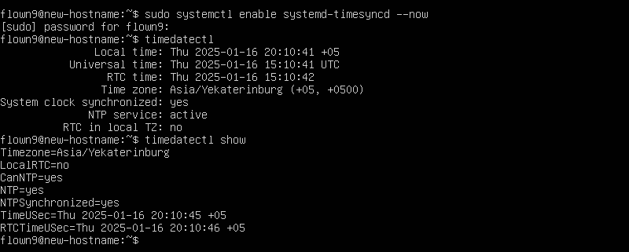

## Part 7. Установка и использование текстовых редакторов

- Содержимое файла test_VIM.txt показано на рисунке 7_1.

- Для выхода с сохранением изменений было введено ":wq" в режиме команд.

- Содержимое файла test_NANO.txt показано на рисунке 7_2.

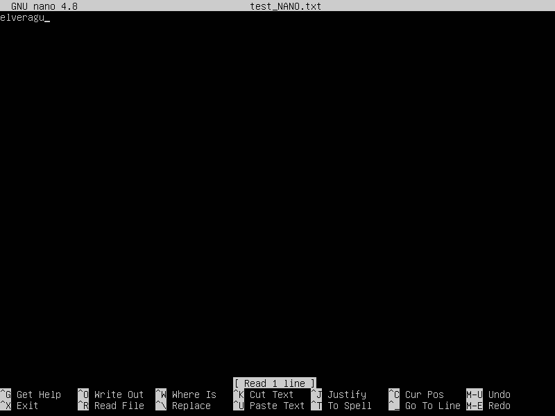

- Для выхода с сохранением изменений было нажато Ctrl + O -> Enter -> Ctrl + X.

- Содержимое файла test_JOE.txt показано на рисунке 7_3.

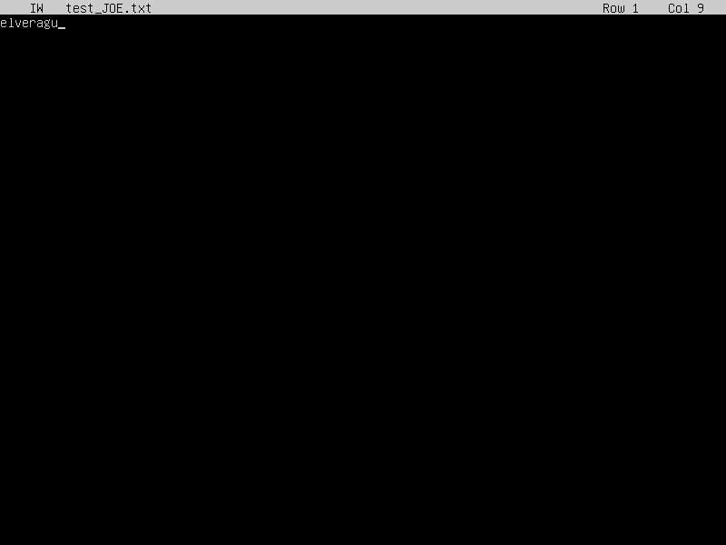

- Для выхода с сохранением изменений было нажато Ctrl + K -> X.

- Редактирование файла test_VIM.txt показано на рисунке 7_4.

- Для выхода без сохранения изменений было введено ":q!" в режиме команд.

- Редактирование файла test_NANO.txt показано на рисунке 7_5.

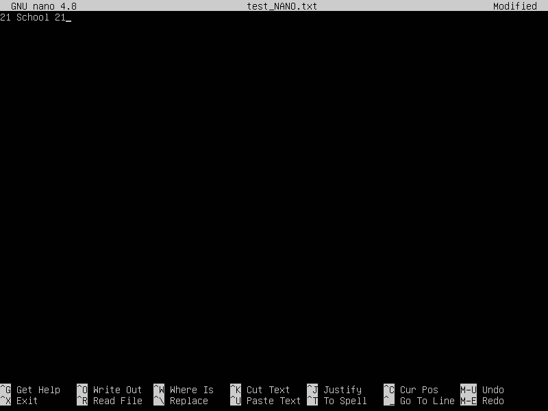

- Для выхода без сохранения изменений было нажато Ctrl + X -> N.

- Редактирование файла test_JOE.txt показано на рисунке 7_6.

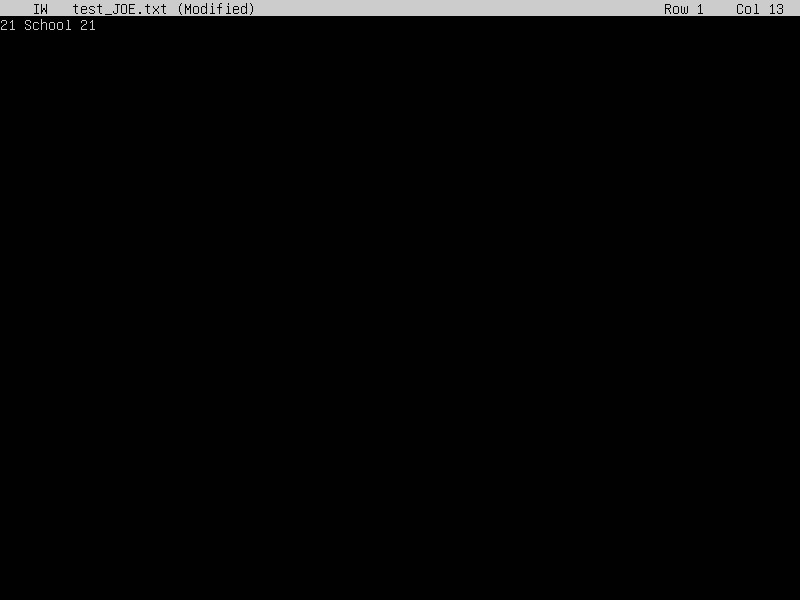

- Для выхода без сохранения изменений было нажато Ctrl + C -> y.

- Функция поиска по содержимому файла test_VIM.txt показана на рисунке 7_7.

- Функция замены слова на любое другое в файле test_VIM.txt показана на рисунке 7_8.

- Функция поиска по содержимому файла test_NANO.txt показана на рисунке 7_9(Ctrl + W).

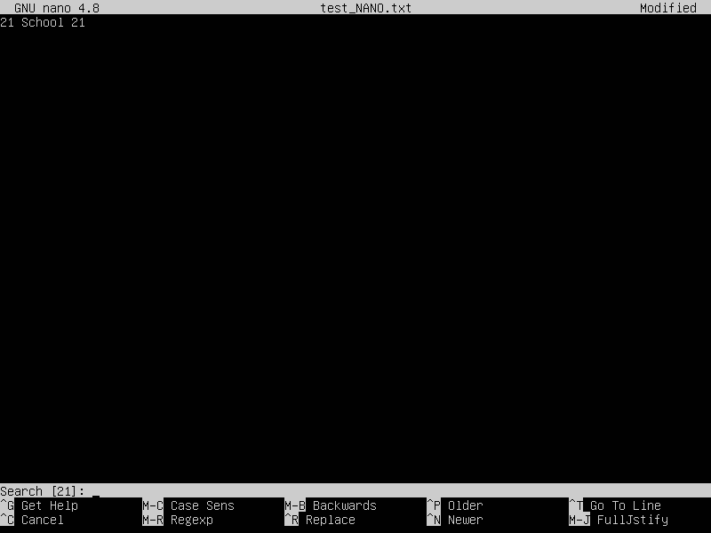

- Функция замены слова на любое другое в файле test_NANO.txt показана на рисунке 7_10(Ctrl + \ -> example -> Enter -> another -> Enter -> A).

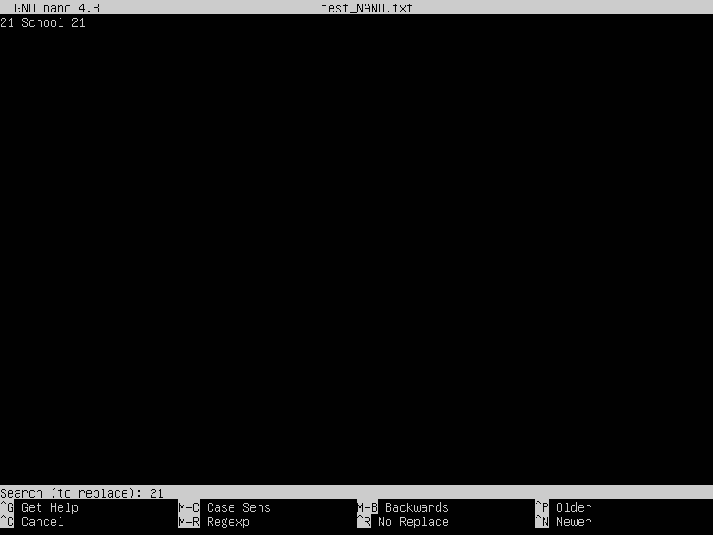

- Функция поиска по содержимому файла test_JOE.txt показана на рисунке 7_11(Ctrl + K -> F).

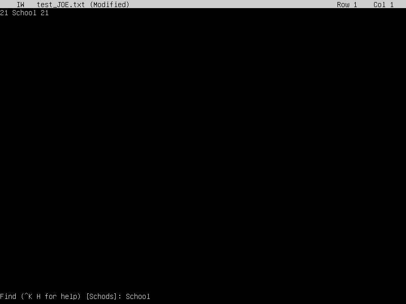

- Функция замены слова на любое другое в файле test_JOE.txt показана на рисунке 7_12(Ctrl + K -> F -> R -> R).

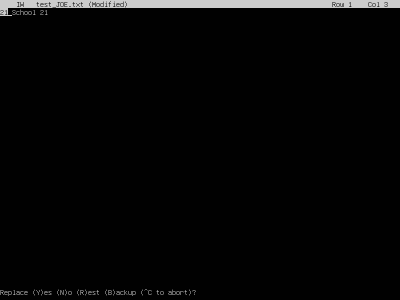

## Part 8. Установка и базовая настройка сервиса SSHD

- Установим службу SSHD с помощью команды sudo apt install openssh-server -y.

- С помощью команды sudo systemctl enable sshd --now добавим автостарт службы при загрузке системы.

- С помощью команды sudo vim /etc/ssh/sshd_config откроем файл и заменим строку #Port 22 на Port 2022.

- На рисунке 8_1 показана команда, которая показывает наличие процесса sshd, и ее вывод.

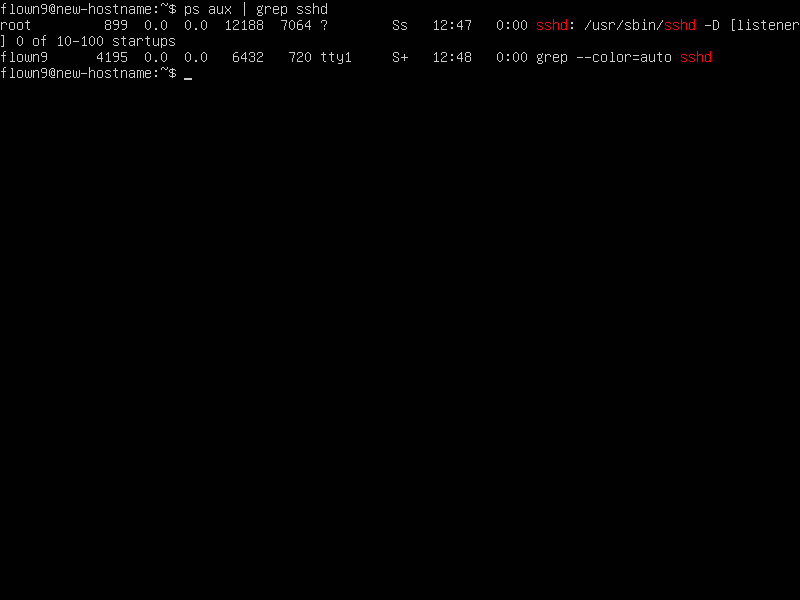

1. ps — команда для отображения информации о процессах.
2. a — показывает процессы всех пользователей.
3. u — выводит данные о пользователе, владельце процесса.
4. x — включает процессы, не связанные с терминалом.
5. | — передаёт вывод одной команды на вход другой (фильтрация).
6. grep sshd — фильтрует только строки, содержащие "sshd".

- Перезагрузим систему с помощью команды sudo reboot now.

- Вывод команды netstat -tan показан на рисунке 8_2 

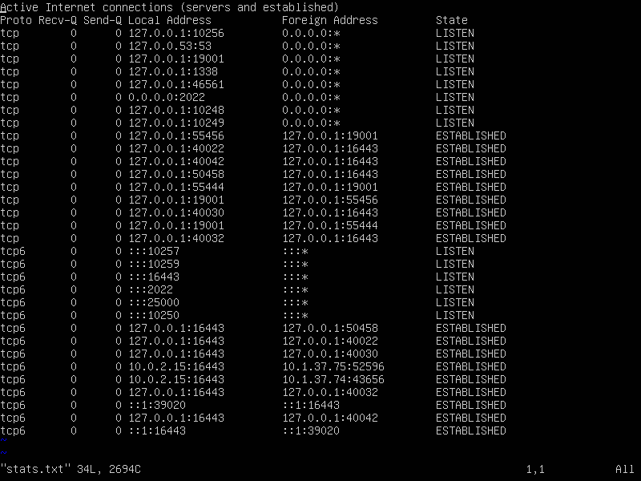

1. t — выводит только TCP-соединения.
2. a — отображает все соединения (включая те, которые находятся в состоянии LISTEN).
3. n — отображает IP-адреса и порты в числовом виде (без разрешения DNS-имен).

- Proto (Протокол) указывает используемый сетевой протокол (TCP или TCP6).

- Recv-Q (Receive Queue) - это количество данных (в байтах), которые уже приняты сетевым стеком устройства, но ещё не обработаны приложением.

- Send-Q (Send Queue) - это количество данных (в байтах), которые программа уже отправила в сокет, но которые ещё не подтверждены удалённым устройством.

- Local Address (Локальный адрес) IP-адрес и порт на локальной машине, на которых открыт сокет.

- Foreign Address (Удалённый адрес)	IP-адрес и порт удалённого узла, с которым установлено соединение. 0.0.0.0:* означает, что принимаются соединения от любых адресов.

- State (Состояние соединения) текущее состояние соединения.

- 0.0.0.0 - это специальный IP-адрес, означающий "все доступные интерфейсы"

## Part 9. Установка и использование утилит top, htop

- Установим top и htop с помощью команды sudo apt install procps htop -y

- Запустим top. Вывод показан на рисунке 9_1

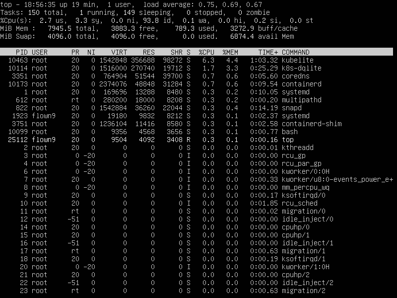

- Uptime (время работы системы) равно 19 минут

- User (количество авторизованных пользователей) 1

- Load average (средняя загрузка системы) 0.75 0.69 0.67

- Tasks (общее кол-во процессов) 150

- %Cpu(s) (загрузка cpu) 
1. us — (User CPU time) время, затраченное на работу программ пользователей 2.7
2. sy — (System CPU time) время, затраченное на работу процессов ядра 3.3
3. ni — (Nice CPU time) время, затраченное на работу программ с измененным приоритетом 0.0
4. id — простой процессора 93.8
5. wa — (iowait) время, затраченное на завершение ввода-вывода 0.1
6. hi — (Hardware IRQ) время, затраченное на обработку hardware-прерываний 0.0
7. si — (Software Interrupts) время, затраченное на работу обработку software-прерываний (network) 0.2
8. st — (Steal Time) время, «украденное» гипервизором у этой виртуальной машины для других задач 0.0

- Mem (оперативная память) 7945.5 всего, 3883.3 свободно, 789.3 занято

- Swap (файл или раздел подкачки) 4096.0 всего, 4096.0 свободно, 0 занято

- Для нахождения pid процесса, занимающего больше всего памяти нажмем Shift + M. Произойдет сортировка по памяти (столбец RES). pid = 10463

- Для нахождения pid процесса, занимающего больше всего процессорного времени нажмем Shift + P. Произойдет сортировка по CPU (столбец %CPU). pid = 10463

- Вывод команды htop с cортировкой по PID показан на рисунке 9_2. (f6)

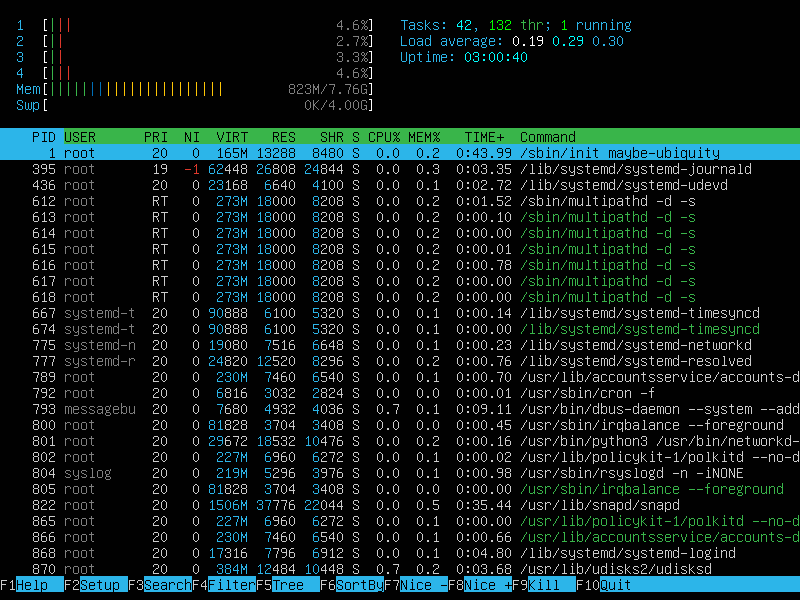

- Вывод команды htop с cортировкой по PERCENT_CPU показан на рисунке 9_3.

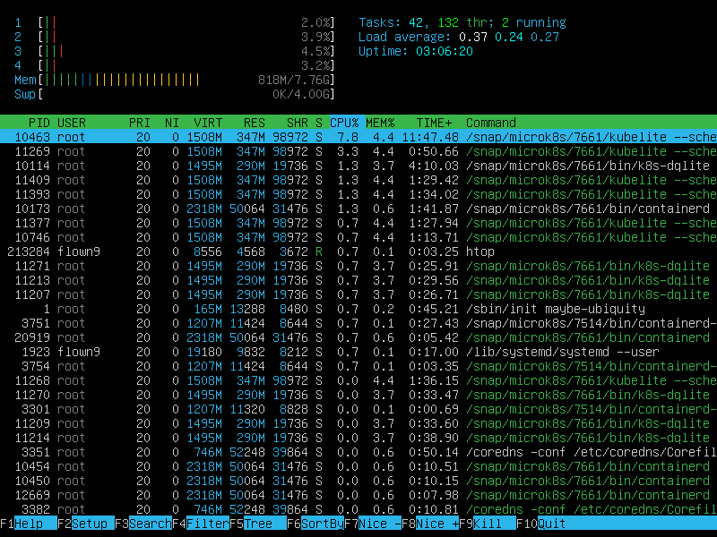

- Вывод команды htop с cортировкой по PERCENT_MEM показан на рисунке 9_4.

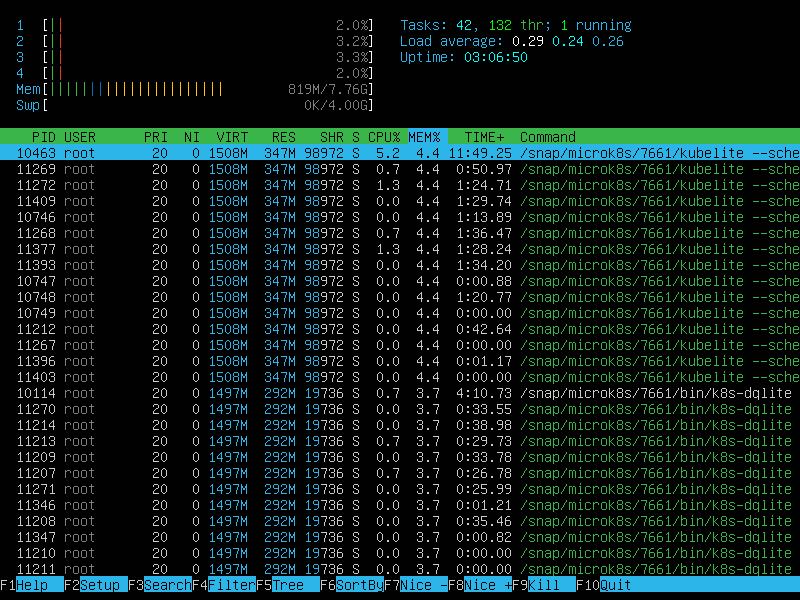

- Вывод команды htop с cортировкой по TIME показан на рисунке 9_5.

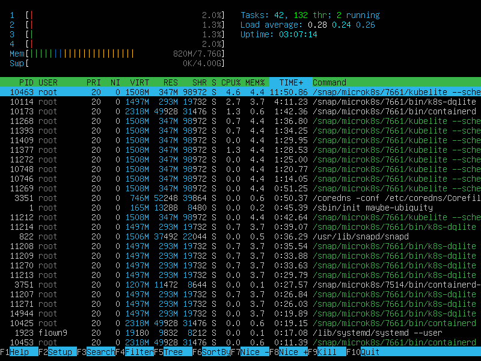

- Вывод команды htop отфильтрованному для процесса sshd показан на рисунке 9_6. (f4)

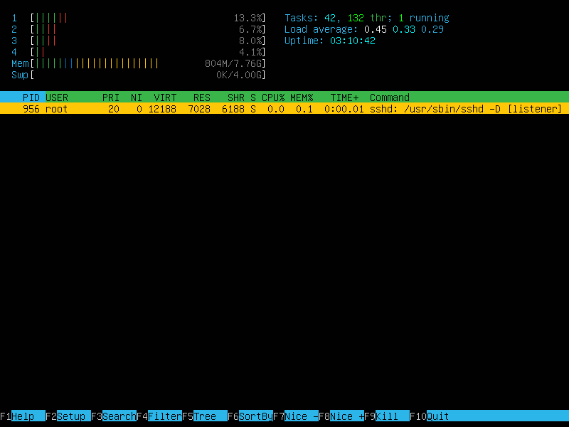

- Вывод команды htop с процессом syslog, найденным, используя поиск показан на рисунке 9_7. (f3)

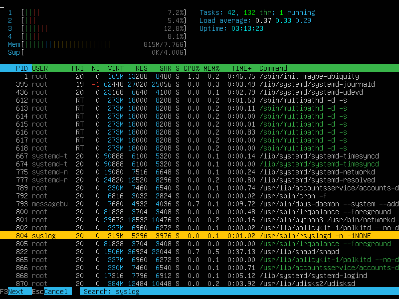

- Вывод команды htop с добавленным выводом hostname, clock и uptime показан на рисунке 9_8. (f2)

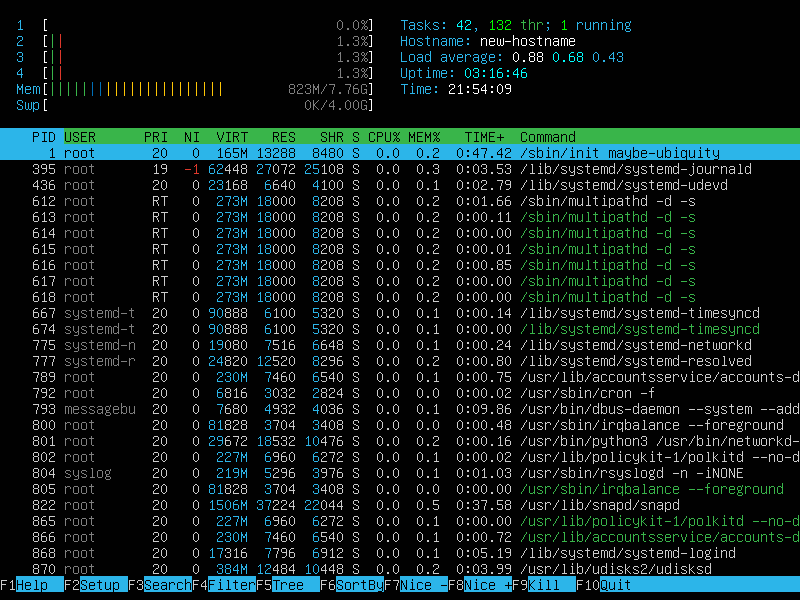

## Part 10. Использование утилиты fdisk

- Название жесткого диск: /dev/sda

- Размер диска: 100 GiB

- Количество секторов 209715 200 sectors

- С помощью команды swapon --show получим информацию о swap-разделе. Размер swap'а 4G